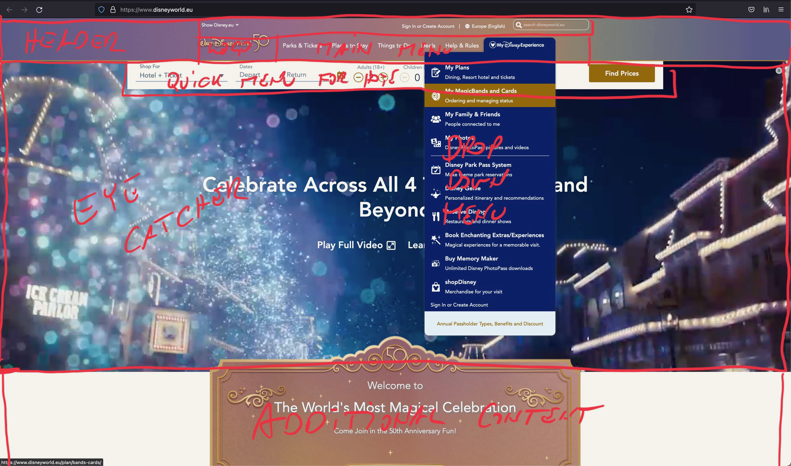
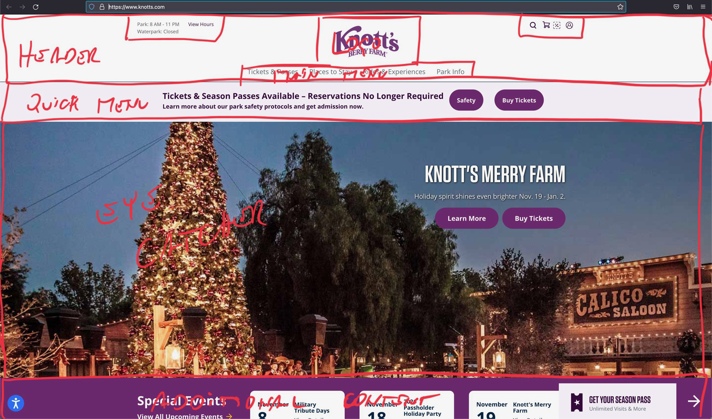
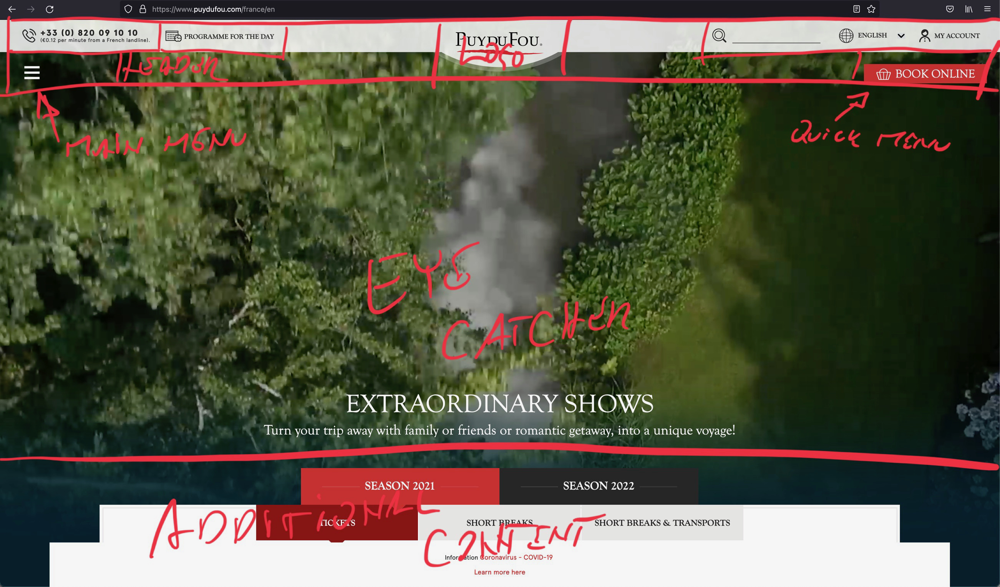
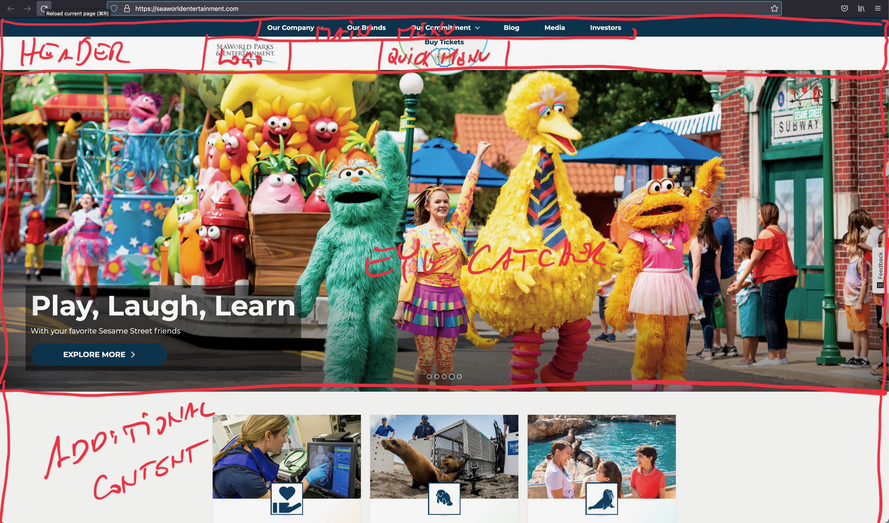
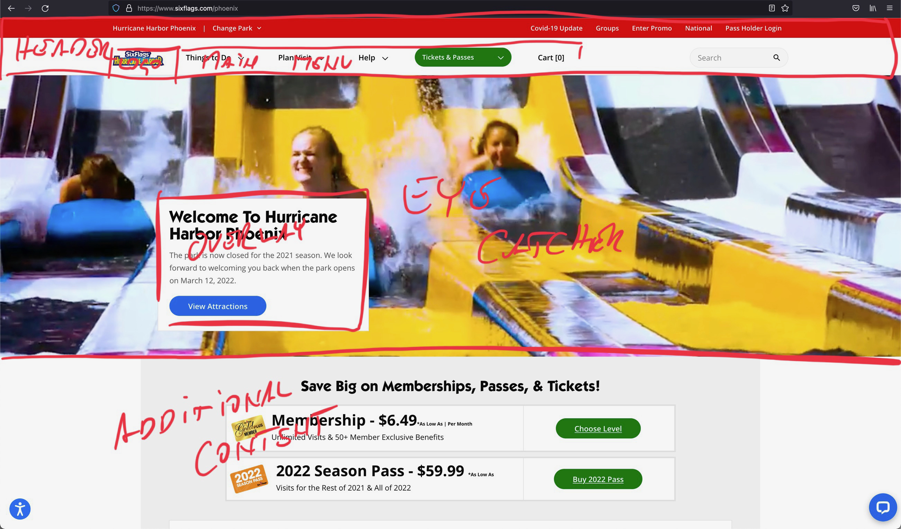
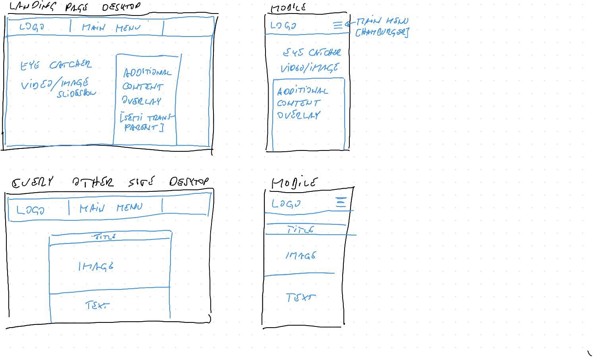

# Peer Graded Assignment 2.4.3

## Part 1 - design specification

### Purpose of the Website

Agree on the purpose of the web site

Discuss the reasons for a theme park operator to have a web site, the people who might look at such a web site and the reasons that they would be looking at the web site.

Why would a theme park operator have a web site?

Main reason for a web site is to attract new customers, inform those and recurring customers about offers and attractions.
For one people might not know about the park and found it via a search engine so they might want to check out what the park offers and hopefully book a ride (or on a bigger scale accommodation and rides).
Recurring visitors to the park and site will be interested to see what new attractions there are, limited offers, etc.

What is the demographic? (who would look at the page, why would they look at that page)

In general the demographic depends on the type of park. If ie. the park is focused on roller coasters the demographic will be mostly younger people searching the thrill of the ride. Obviously there are outliers in this statistical point of view but those will still fit the general customer profile very well.

According to VR market analysis the demographic for a our imagined VR theme park will be young adult males age 16-34. Obviously the theme park and all marketing material must be adapted to suit a broader age and gender range.

### Research theme park web sites

Choose five theme park web sites
- https://www.disneyworld.eu/
- https://seaworldentertainment.com/
- https://www.knotts.com/
- https://www.sixflags.com/
- https://www.puydufou.com/en

Even though these are all different theme parks the overarching theme of their site is the same:
- Hotel/Ticket reservations and attractions are the most important part
- All sites feature full with video playback/image on the landing page as major eye catcher
- Basic (landing) site structure is also almost the same on all sites
	- header with main menu, logo + additional information (only as high as necessary to be easily readable and found)
	- full screen video/image with minimal content overlay (purely visual candy)
	- additional content (partially overlaying the full screen video/image) (some additional details, special offers, etc.)
- Good is the eye candy, the videos/images deliver an immediate positive gut reaction
- Bad? these sites have so much customer feedback that they are optimised to satisfy the demographic visiting these pages. So the bad part is probably that if you're not visiting the site for the exact purpose of buying a ticket or looking up an attraction it might be hard to find the right information - arguably this is a problem of all web sites though. From a technical point of view the dependency on videos and huge images an d therefore devices and connections that support that might be considered bad. But considering the demographic again this is not an issue.

### Agree on the content for the web site

What is the theme of the theme park?
- Virtual Reality Park : every park guest wears a VR headset inside an attraction which shows a personalised park experience. The "physical" park attractions add "real" elements to touch and feel to the VR experience. I.e. running through a snow storm on Hoth will be simulated by blowing cold air on the running gamers, other (in VR tracked) structural elements (boulders, trees, etc.) add a real life component.

What attractions are there?
- VR FPS
- different escape rooms

List of other services (food, medical, etc.)
- food court
- medical services (nausea, blunt trauma ward)
- indoor area to experience VR (a certain square footage per person with table and couch)

### Agree on the structure of the web site

The basic site design will follow the wireframe consensus of all the other theme park sites.

What will be shown on the main page?
- landing page will show a VR headset and park experience in VR (sliding pictures?)

What will be shown on the other two?
- park layout overview and attractions
- reservation and contact page

### Design the wireframes for the web site

Review criteria

Marks will be awarded for the following:

Identification of purpose of web site to the appropriate stakeholders

Evidence and analysis of 5 theme park web sites

Identification of relevant and appropriate content for the web site

Identification of an appropriate structure for the pages for the content for this web site

Design of the wireframes as a clear model for the web site
